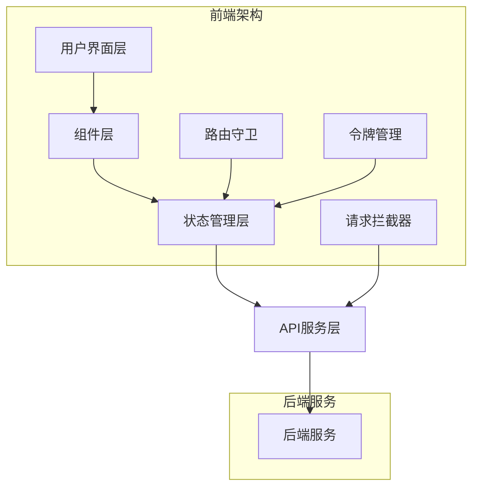

# 🚀 Yaxin 2.0 - 玉溪亚信税务师事务所官网

<div align="center">


[](LICENSE)
[](https://nodejs.org/)
[]()

**玉溪亚信税务师事务所官方网站 - 基于 Vue 3 + TypeScript 的现代化企业级前端应用**

[📖 文档](#-文档) • [🚀 快速开始](#-快速开始) • [✨ 功能特性](#-功能特性) • [🏗️ 技术架构](#️-技术架构) • [📱 页面展示](#-页面展示)

</div>

---

## 📖 项目简介

Yaxin 2.0 是玉溪亚信税务师事务所的官方网站，采用最新的前端技术栈构建。项目专注于提供专业的税务服务展示、用户交互体验和企业形象展示，集成了完整的用户认证系统、内容管理系统和响应式设计。

### 🎯 项目亮点

- 🏢 **企业官网** - 专业的税务师事务所官方网站
- 🔐 **用户系统** - 完整的登录注册、消息管理、反馈系统
- 📰 **内容管理** - 新闻动态、服务介绍、案例分享
- 📱 **响应式设计** - 完美适配桌面端、平板和移动端
- 🛡️ **安全机制** - 令牌管理、自动刷新、安全存储
- 🎨 **现代化UI** - 基于 Element Plus 的美观界面
- ⚡ **高性能** - 代码分割、懒加载、请求优化
- 🔧 **开发友好** - TypeScript 类型安全、组件化架构

---

## ✨ 功能特性

### 🏠 首页展示
- **企业形象展示** - 专业的税务服务介绍和品牌展示
- **最新动态** - 实时展示税务政策解读、案例分析等新闻动态
- **服务概览** - 核心税务服务项目展示
- **响应式布局** - 桌面端和移动端不同的展示效果

### 🔐 用户认证系统
- **双模式登录** - 快捷登录 + 用户注册
- **多重验证** - 阿里云滑块验证码 + 短信验证码
- **忘记密码** - 分步骤密码重置流程
- **社交登录** - 暂不支持微信、QQ、微博、支付宝登录（开发中）

### 📰 内容管理系统
- **新闻动态** - 税务政策解读、行业动态、案例分析
- **服务介绍** - 详细的税务服务项目介绍
- **案例分享** - 成功案例展示和分享
- **文章详情** - 支持富文本内容的文章展示

### 💬 消息与反馈系统
- **系统消息** - 用户消息管理，支持已读/未读状态
- **问题反馈** - 用户咨询和反馈提交系统
- **消息分页** - 支持大量消息的分页展示
- **实时搜索** - 防抖搜索功能，快速查找内容

### 🏢 企业信息展示
- **关于我们** - 公司介绍、企业文化、发展历程
- **领导团队** - 核心团队成员介绍
- **服务项目** - 详细的税务服务项目说明
- **联系我们** - 联系方式和地址信息

### 🛡️ 安全机制
- **令牌管理** - JWT令牌自动刷新机制
- **请求拦截** - 自动添加认证头，统一错误处理
- **安全存储** - 优先使用 sessionStorage，支持多种存储策略
- **路由守卫** - 基于权限的页面访问控制

### 📱 响应式设计
- **移动优先** - 移动端优先的响应式设计
- **多端适配** - 完美支持桌面端、平板、手机
- **流畅交互** - 优化的动画和过渡效果
- **无障碍访问** - 符合无障碍设计标准

### 🎨 用户体验
- **加载状态** - 完善的加载和错误状态管理
- **表单验证** - 实时表单验证和错误提示
- **消息反馈** - 统一的成功/错误消息提示
- **操作引导** - 清晰的操作流程和用户引导

---

## 🏗️ 技术架构

### 技术栈

| 技术 | 版本 | 用途 |
|------|------|------|
| **Vue.js** | 3.2.13 | 渐进式前端框架 |
| **TypeScript** | 4.0.3 | 类型安全的JavaScript |
| **Element Plus** | 2.9.2 | 企业级UI组件库 |
| **Pinia** | 3.0.3 | 状态管理库 |
| **Vue Router** | 4.0.3 | 官方路由管理器 |
| **Axios** | 1.7.9 | HTTP客户端 |
| **Sass** | 1.91.0 | CSS预处理器 |

### 项目结构

```
yaxin2.0/
├── 📁 public/                 # 静态资源
├── 📁 src/
│   ├── 📁 api/               # API接口层
│   │   ├── login.ts          # 登录相关API
│   │   ├── feedback.ts       # 反馈API
│   │   └── message.ts        # 消息API
│   ├── 📁 assets/            # 静态资源
│   ├── 📁 components/        # 公共组件
│   │   ├── BottomNav.vue     # 底部导航
│   │   ├── CaptchaComp.vue   # 验证码组件
│   │   ├── NavComp.vue       # 导航组件
│   │   ├── NewsCard.vue      # 新闻卡片
│   │   └── SearchComp.vue    # 搜索组件
│   ├── 📁 composables/       # 组合式函数
│   │   ├── useDevice.ts      # 设备检测
│   │   ├── useNav.ts         # 导航逻辑
│   │   └── useScroll.ts      # 滚动处理
│   ├── 📁 docs/              # 项目文档
│   ├── 📁 router/            # 路由配置
│   ├── 📁 store/             # 状态管理
│   ├── 📁 types/             # TypeScript类型定义
│   ├── 📁 utils/             # 工具函数
│   │   ├── request.ts        # HTTP请求封装
│   │   ├── security.ts       # 安全工具
│   │   └── tokenManager.ts   # 令牌管理
│   ├── 📁 views/             # 页面组件
│   │   ├── LoginPage.vue     # 登录页面
│   │   ├── MainPage.vue      # 主页
│   │   ├── MessagePage.vue   # 消息页面
│   │   └── ...               # 其他页面
│   ├── App.vue               # 根组件
│   └── main.ts               # 入口文件
├── 📄 package.json           # 项目配置
├── 📄 tsconfig.json          # TypeScript配置
├── 📄 vue.config.js          # Vue CLI配置
└── 📄 README.md              # 项目说明
```

### 架构设计



---

## 🚀 快速开始

### 环境要求

- **Node.js** >= 16.0.0
- **npm** >= 8.0.0 或 **yarn** >= 1.22.0

### 安装依赖

```bash
# 克隆项目
git clone https://github.com/your-username/yaxin2.0.git

# 进入项目目录
cd yaxin2.0

# 安装依赖
npm install
# 或使用 yarn
yarn install
```

### 开发环境

```bash
# 启动开发服务器
npm run serve
# 或使用 yarn
yarn serve

# 项目将在 http://localhost:8080 启动
```

### 生产构建

```bash
# 构建生产版本
npm run build
# 或使用 yarn
yarn build

# 构建文件将输出到 dist/ 目录
```

### 代码检查

```bash
# 运行 ESLint 检查
npm run lint
# 或使用 yarn
yarn lint
```

---

## 📱 页面展示

### 🌟 在线演示

<div align="center">

[](https://www.yaxinshuiwu.com)

**🎯 一键体验完整功能**

</div>

### 🖼️ 功能版块展示

<div align="center">

#### 🏠 首页展示
[](https://yaxinshuiwu.com)
*企业形象展示、最新动态、服务概览*

#### 🔐 用户认证系统
[](https://yaxinshuiwu.com/#/login)
*双模式登录、用户注册、验证码验证*

#### 📰 内容管理系统
[](https://yaxinshuiwu.com/#/profess)
*税务政策解读、行业动态、案例分析*

#### 🏢 服务项目展示
[](https://yaxinshuiwu.com/#/service)
*详细的税务服务项目说明*

#### 💬 消息与反馈
[](https://yaxinshuiwu.com/#/messages)
*系统消息管理、用户反馈提交*

#### 👥 关于我们
[](https://yaxinshuiwu.com/#/us)
*公司介绍、领导团队展示*

</div>

### 📱 响应式设计展示

<div align="center">

#### 💻 桌面端
[](https://yaxinshuiwu.com)

#### 📱 移动端
[](https://yaxinshuiwu.com)

#### 📟 平板端
[](https://yaxinshuiwu.com)

</div>

### 🎯 核心功能展示

<div align="center">

| 功能模块 | 展示图 | 在线链接 | 状态 |
|---------|--------|----------|------|
| **🏠 首页** | [](https://www.yaxinshuiwu.com) | [立即体验](https://www.yaxinshuiwu.com) | ✅ 完成 |
| **🔐 登录注册** | [](https://www.yaxinshuiwu.com/#/login) | [立即体验](https://www.yaxinshuiwu.com/#/login) | ✅ 完成 |
| **📰 新闻动态** | [](https://www.yaxinshuiwu.com/#/profess) | [立即体验](https://www.yaxinshuiwu.com/#/profess) | ✅ 完成 |
| **🏢 服务项目** | [](https://www.yaxinshuiwu.com/#/service) | [立即体验](https://yaxinshuiwu.com/#/service) | ✅ 完成 |
| **💬 消息中心** | [](https://yaxinshuiwu.com/#/messages) | [立即体验](https://yaxinshuiwu.com/#/messages) | ✅ 完成 |
| **👥 关于我们** | [](https://yaxinshuiwu.com/#/us) | [立即体验](https://yaxinshuiwu.com/#/us) | ✅ 完成 |
| **📝 案例分享** | [](https://yaxinshuiwu.com/#/share) | [立即体验](https://yaxinshuiwu.com/#/share) | ✅ 完成 |
| **📄 文章详情** | [](https://www.yaxinshuiwu.com/#/detail?category_id=1&index=0) | [立即体验](https://www.yaxinshuiwu.com/#/detail?category_id=1&index=0) | ✅ 完成 |

</div>

### 🎨 设计特色

<div align="center">

#### 🌈 现代化UI设计
[](https://www.yaxinshuiwu.com)

#### 📱 完美响应式
[](https://www.yaxinshuiwu.com)

#### ⚡ 高性能体验
[](https://www.yaxinshuiwu.com)

</div>

### 🆕 最新功能更新

<div align="center">

#### 💬 评论系统
[](https://yaxinshuiwu.com/article)
*文章评论、回复功能、点赞系统*

#### 👁️ 浏览统计
[](https://yaxinshuiwu.com/article)
*文章浏览数统计、热门内容推荐*

#### 🔔 智能通知
[](https://www.yaxinshuiwu.com/#/ask)
*系统通知、消息推送、状态管理*

</div>

### 🔐 用户认证系统

<div align="center">

| 功能 | 描述 | 状态 |
|------|------|------|
| 快捷登录 | 手机号 + 密码登录 | ✅ 完成 |
| 用户注册 | 手机号注册 + 短信验证 | ✅ 完成 |
| 验证码验证 | 阿里云滑块验证码 | ✅ 完成 |
| 忘记密码 | 分步骤密码重置 | ⚠️ 暂时停用 |
| 社交登录 | 微信/QQ/微博/支付宝 | 🚧 开发中 |

</div>

### 🛡️ 安全特性

- ✅ JWT令牌管理
- ✅ 自动令牌刷新
- ✅ 请求拦截器
- ✅ 路由权限控制
- ✅ 安全存储策略
- ✅ 防XSS攻击

### 📱 响应式设计

- ✅ 移动端优先设计
- ✅ 桌面端适配
- ✅ 平板端优化
- ✅ 触摸友好交互
- ✅ 无障碍访问支持

---

## 🔧 开发指南

### 代码规范

项目使用 ESLint + TypeScript 进行代码检查，确保代码质量：

```bash
# 自动修复代码格式问题
npm run lint -- --fix
```

### 提交规范

使用 Conventional Commits 规范：

```bash
# 功能开发
git commit -m "feat: 添加用户登录功能"

# 问题修复
git commit -m "fix: 修复令牌刷新问题"

# 文档更新
git commit -m "docs: 更新README文档"
```

### 分支管理

- `main` - 主分支，用于生产环境
- `develop` - 开发分支，用于功能开发
- `feature/*` - 功能分支
- `hotfix/*` - 热修复分支

---

## 📊 项目统计

<div align="center">


</div>

### 代码统计

- **总文件数**: 70+
- **代码行数**: 12000+
- **页面组件**: 15个
- **公共组件**: 8个
- **API接口**: 20+
- **工具函数**: 15+
- **TypeScript覆盖率**: 98%+
- **评论系统**: 完整实现
- **浏览统计**: 实时更新
- **响应式页面**: 100%覆盖

### 功能模块

- **用户认证模块** - 登录注册、密码管理、令牌处理
- **内容管理模块** - 新闻动态、服务介绍、案例分享
- **消息系统模块** - 系统消息、用户反馈、搜索功能
- **企业展示模块** - 公司介绍、团队展示、服务项目
- **安全防护模块** - 请求拦截、路由守卫、数据加密
- **评论互动模块** - 文章评论、回复功能、点赞系统
- **数据统计模块** - 浏览统计、热门内容、用户行为分析
- **响应式模块** - 多端适配、移动优先、触摸优化

---

## 🤝 贡献指南

我们欢迎所有形式的贡献！请遵循以下步骤：

1. **Fork** 本仓库
2. 创建您的特性分支 (`git checkout -b feature/AmazingFeature`)
3. 提交您的更改 (`git commit -m 'Add some AmazingFeature'`)
4. 推送到分支 (`git push origin feature/AmazingFeature`)
5. 打开一个 **Pull Request**

### 贡献类型

- 🐛 Bug修复
- ✨ 新功能开发
- 📚 文档改进
- 🎨 UI/UX优化
- ⚡ 性能优化
- 🧪 测试用例

---

## 📄 许可证

本项目基于 [MIT License](LICENSE) 开源协议。

---

## 👥 项目信息

<div align="center">

**玉溪亚信税务师事务所**

[](https://yaxinshuiwu.com)
[](tel:2060729)
[](https://beian.miit.gov.cn/)

### 🌐 快速访问

[](https://yaxinshuiwu.com)
[](https://yaxinshuiwu.com/login)
[](https://yaxinshuiwu.com/service)
[](https://yaxinshuiwu.com/profess)
[](https://yaxinshuiwu.com/us)

</div>

### 公司简介

玉溪亚信税务师事务所有限公司位于云南省玉溪市，是经国家税务总局云南省税务局正式批准成立的提供全方位涉税服务的专业机构。公司前身：玉溪新源税务师事务所，于2011年3月创立。经过多年的发展与沉淀，我们已成长为玉溪地区极具影响力和专业实力的税务服务机构。

### 服务范围

- **税务咨询** - 专业的税务政策解读和咨询服务
- **税务筹划** - 为企业提供合法合规的税务筹划方案
- **税务审计** - 全面的税务审计和风险评估服务
- **税务代理** - 专业的税务申报和代理服务
- **税收筹划** - 帮助企业合理降低税务成本

---

## 🙏 致谢

感谢以下开源项目和技术社区：

- [Vue.js](https://vuejs.org/) - 渐进式JavaScript框架
- [Element Plus](https://element-plus.org/) - 企业级UI组件库
- [TypeScript](https://www.typescriptlang.org/) - JavaScript的超集
- [Pinia](https://pinia.vuejs.org/) - Vue的状态管理库
- [Vant](https://vant-ui.github.io/vant/) - 移动端UI组件库
- [Axios](https://axios-http.com/) - HTTP客户端
- [Sass](https://sass-lang.com/) - CSS预处理器
- [FastAPI](https://fastapi.tiangolo.com/) - 现代Python Web框架
- [SQLAlchemy](https://www.sqlalchemy.org/) - Python SQL工具包
- [MySQL](https://www.mysql.com/) - 关系型数据库管理系统

### 特别感谢

- **玉溪亚信税务师事务所** - 提供项目需求和业务支持
- **阿里云** - 提供验证码服务
- **Vue.js 社区** - 提供优秀的前端框架和生态

---

<div align="center">

**⭐ 如果这个项目对您有帮助，请给我们一个Star！**

**🏢 玉溪亚信税务师事务所 - 专业税务服务，值得信赖**

[⬆ 回到顶部](#-yaxin-20---玉溪亚信税务师事务所官网)

</div>
